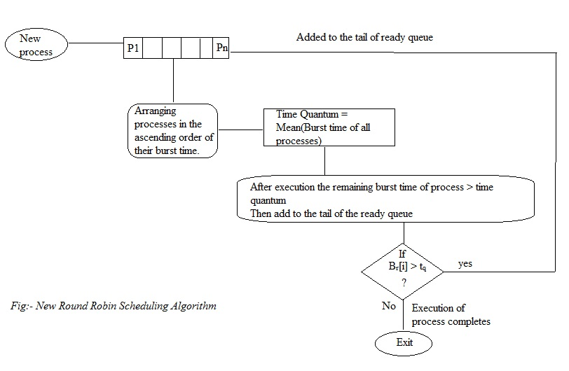

# Round_robin
Round Robin Scheduling Algorithm with Dynamic Time Quantum

The objective of this work was to enhance the performance of the round-robin scheduling algorithm. We implemented a real-time scheduling algorithm to minimize average waiting time, allowing the set of given tasks to be completed efficiently and effectively by introducing a dynamic time quantum.
Additionally, it is essential to consider the advantages and disadvantages of this approach. Tasks are created in real-time systems to perform specific services during execution, making each task vital to the system's overall performance. In contrast to non-real-time systems, which do not consider deadlines, real-time systems prioritize deadlines as the primary factor in task scheduling.

